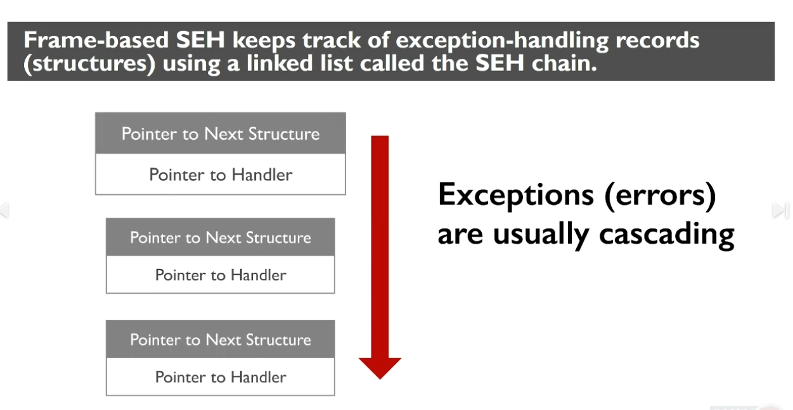

# Handling Misdirection Techniques

## Structured exception handling

Malicious actors can take advantage of Structured Exception Handling which is a mechanism for  graciously handling errors. Each 32-bit SEH record is stored on the stack as a structure that's comprised of two memory addresses.&#x20;

1. Pointer to exception-handling function
2. Pointer to preciously defined SEH record, this allows Windows to maintain a linked list (chain) of SEH structures

64-bit SEH records employed a table-based approach which the compiler generates a table that describes the programs exception handlers, embedding this table in the files PE header.

<figure><figcaption></figcaption></figure>

<figure><figcaption></figcaption></figure>

<figure><figcaption>
End of SEH chain
</figcaption></figure>

How does Windows know where to START navigating the chain?

* Windows look in **FS:\[0]** to find the address of the most recently added SEH structure

The SEH tab in x32dbg shows the SEH chain

Writing into the first part of the data segment always causes an exception because it's non-writable

<figure><figcaption>
causing an exception
</figcaption></figure>

<figure><figcaption>
Causing an exception that executes malicious code
</figcaption></figure>

Lets practice first by assuming we know nothing about the malware, which we normally don't:

1. Trying to read strings in PeStudio, if there are few readable strings, it could be packed
2. Exeinfo PE and other tools (like Detect It Easy) identify the potential packer

## Unpackers cleaning up the stack

## References


64 bit exception handling



32-bit exception handling


## Tools

|                |   |   |
| -------------- | - | - |
| Detect It Easy |   |   |
| PeStudio       |   |   |
| Exeinfo PE     |   |   |
| x32dbg         |   |   |
|                |   |   |
|                |   |   |
