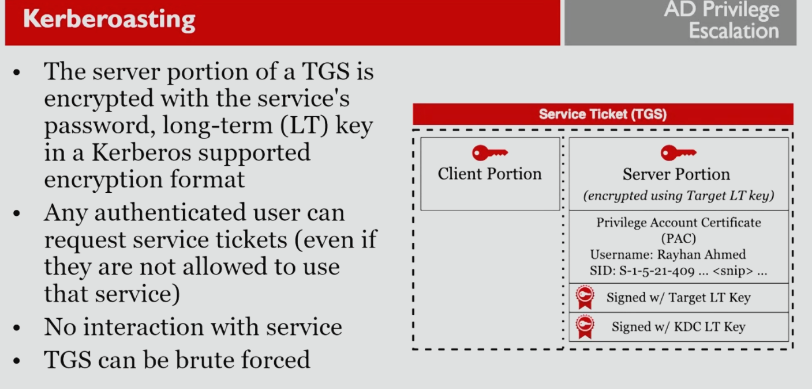

# Code Injection and API Hooking

## Code Injection APIs

Malware authors use several Windows API calls to implement **code injection**:

**CreateToolhelp32Snapshot** or **EnumProcesses**: geta s listing of running processes

**OpenProcess**: Opens a handle to the targeted process

**VirtualAllocEx**: Allocated memory space in the TARGETED process (don't confuse this with VirtualAlloc)

**WriteProcessMemory**: Write specified contents into memory of the targeted process

**CreateRemoteThread**: Runs code in a new thread of the process

Some malware specimins call behind-the-scenes Native APIs instead of official WindowsAPIs to operate more stealthily

Native APIs are used by the official Windows API functions:

* CreateToolhelp32Snapshot: NTQuerySystemInformation
* OpenProcess: NtOpenProcess/ZwOpenProcess
* VirtualAllocEx: NtAllocateVirtualMemory
* WriteProcessMemory: NtWriteVirtualMemory

## Hooking

Hooking - intercepting the execution of intended code

A user-mode rootkit generally wants to hook targeted functions to interfere with their functionality

Hooks could be used for concealment and to "spy" on the victims activities

Inline Hooks - patch the beginning of the targeted functions to jump into the rootkit

Some other types of hooks (not discussed):

* call table hooks
* Layering / queueing hooks


Look for **ReadProcessMemory** used in conjunction with **WriteProcessMemory** to spot potential API hooking code


<figure><figcaption></figcaption></figure>

## Normal flow of information

<figure><figcaption></figcaption></figure>

## Inline Hook

<figure><figcaption></figcaption></figure>

<figure><figcaption></figcaption></figure>


These are all normal API calls that are taken advantage of by malware authors

